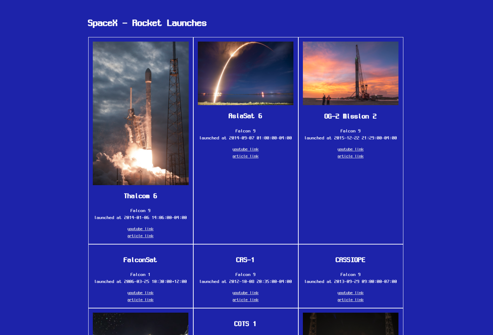
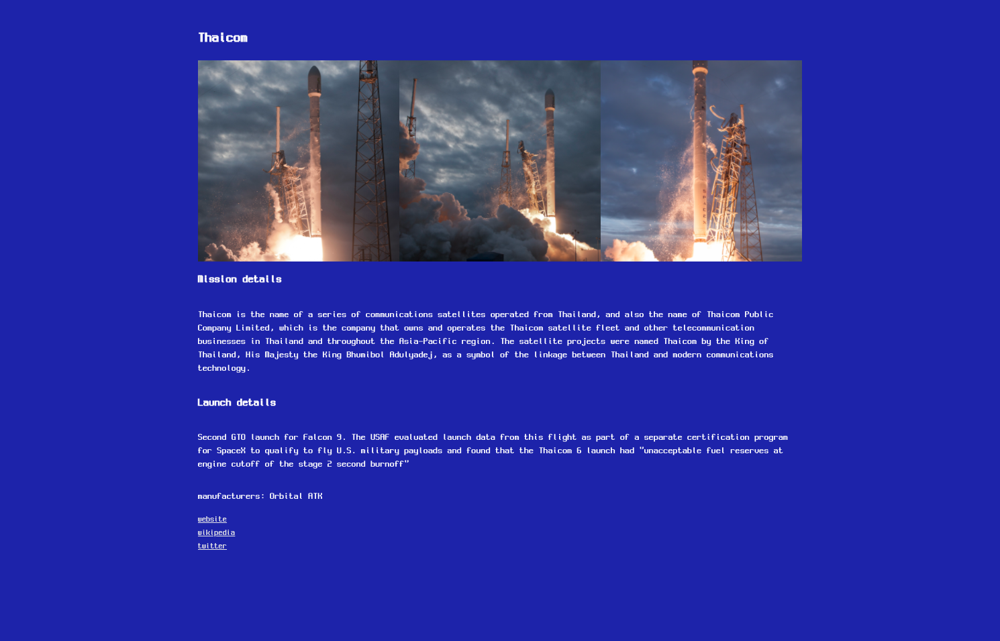
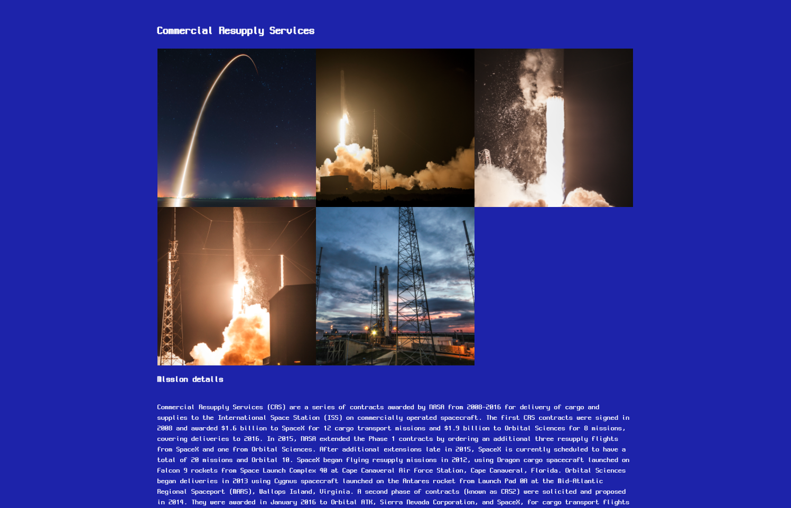
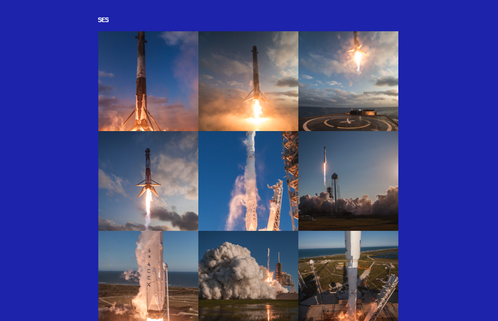

## SpaceX Missions
🚀 See Missions of SpaceX






```bash
yarn
yarn start
```


### What I Learned in GQL

* 쿼리와 뮤테이션
  * 쿼리: C
  * 뮤테이션 :  RUD

* 일반 쿼리와 오퍼레이션 네임 쿼리
  * 일반 쿼리 : 변수가 없는 static한 쿼리 (start with curly-braces)
  * 오퍼레이션 네임 쿼리: 변수가 있는 쿼리 (쿼리용 함수, DB의 프로시져 느낌)


#### built by

* React
* TypeScript
* Material-ui
* SCSS
* Apollo Client
* GraphQL
